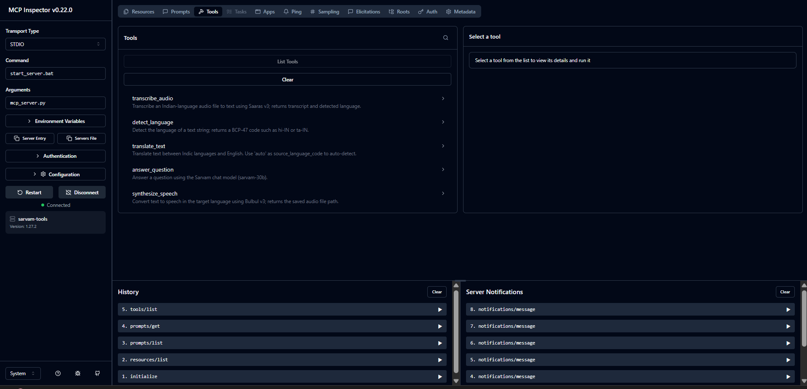
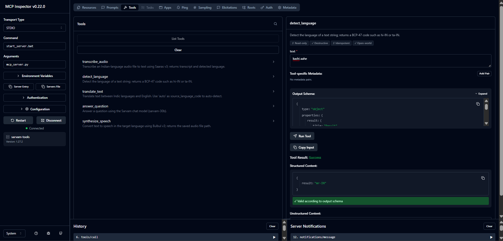
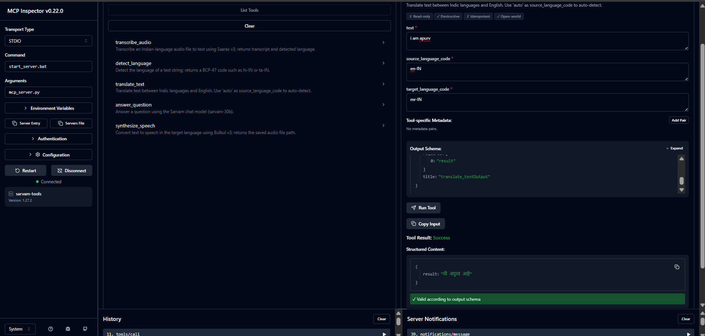
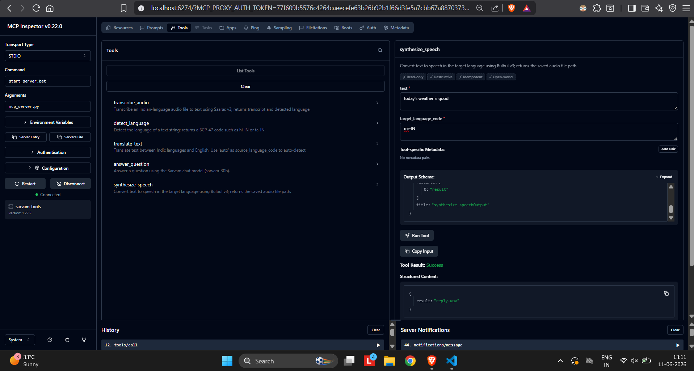
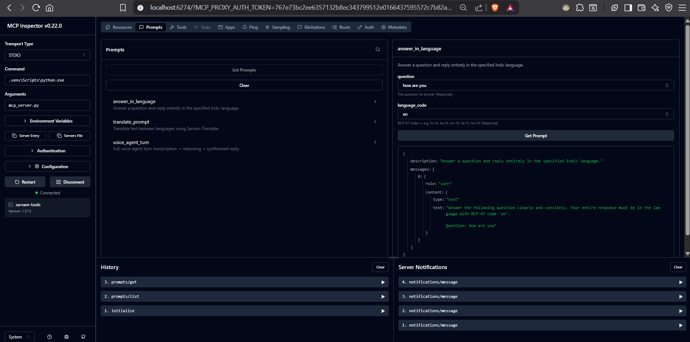

# Setu — Multilingual Voice Agent on Sarvam AI

> *Setu* (सेतु) means **bridge**. Speak a question in any major Indian language; an AI agent reasons over Sarvam's speech, translation, and chat tools and speaks the answer back in your language.

<br>

## Demo

Run the scripted demo without a microphone:

```bash
python app.py --demo
```

This runs 3 scripted turns (each a follow-up on the last, to show memory works),
prints every tool call the agent makes, and saves the spoken replies as WAV files.

*(add demo.gif here after recording)*

<br>

## What this project demonstrates

| Capability | How |
|---|---|
| Hands-on use of Sarvam models | Saaras v3 (STT), Bulbul v3 (TTS), Sarvam-Translate, sarvam-30b (chat) |
| Building an MCP server from scratch | FastMCP server with 5 tools, 2 resources, 3 prompts — testable in the MCP Inspector |
| Authoring an agent without a framework | `scratch_agent.py` — a hand-written JSON tool-call loop, no LangChain/LangGraph |
| Authoring the same agent with a framework | `graph_agent.py` — LangGraph ReAct consuming the same MCP server |

<br>

## Architecture

```
  User speaks  (Hindi / Marathi / Tamil / ...)
        │  audio in
        ▼
  ┌──────────────────────────┐
  │  app.py  (CLI)           │  record mic → run agent → play reply
  └──────────────────────────┘
        │  audio path / text query
        ▼
  ┌──────────────────────────┐      tool calls over MCP / JSON protocol
  │  Agent orchestrator      │ ─────────────────────────────────────────┐
  │                          │                                          │
  │  scratch_agent.py        │                                          │
  │  (no framework)    OR    │ ◄────────────────────────────────────────┘
  │  graph_agent.py          │      tool results
  │  (LangGraph)             │
  └──────────────────────────┘
                                              │
                                              ▼
                               ┌──────────────────────────────┐
                               │  mcp_server.py               │
                               │  "sarvam-tools"  (FastMCP)   │
                               │                              │
                               │  transcribe_audio  ────────► Saaras v3
                               │  detect_language   ────────► sarvam-30b
                               │  translate_text    ────────► Sarvam-Translate
                               │  answer_question   ────────► sarvam-30b
                               │  synthesize_speech ────────► Bulbul v3
                               └──────────────────────────────┘
                                              │
                                              ▼
                               ┌──────────────────────────────┐
                               │  sarvam_client.py            │
                               │  single source of truth      │
                               │  for every Sarvam API call   │
                               └──────────────────────────────┘
```

The agent **decides** which tools to call and in what order. A typical turn looks like:

1. `transcribe_audio` — WAV → text + detected language (e.g. `hi-IN`)
2. `translate_text` — translate question to English for better reasoning accuracy
3. `answer_question` — get the answer from `sarvam-30b`
4. `translate_text` — translate answer back to the user's language
5. `synthesize_speech` — text → WAV via Bulbul v3

The agent may skip steps (e.g. answer directly in Hindi without translation hops when the model handles it natively). That decision is the agent's, not hard-coded logic.

<br>

## Tech stack

| Layer | Library / Model |
|---|---|
| Speech-to-text | Sarvam **Saaras v3** |
| Translation | Sarvam **Sarvam-Translate / Mayura** |
| Chat / reasoning | Sarvam **sarvam-30b** (64 K context, native tool calling) |
| Text-to-speech | Sarvam **Bulbul v3** |
| MCP server | **FastMCP** (`mcp` Python SDK) |
| Framework agent | **LangGraph** + `langchain-mcp-adapters` + `langchain-openai` |
| Audio I/O | `sounddevice` + `scipy` |
| Config | `python-dotenv` |

<br>

## Project structure

```
setu/
├── sarvam_client.py      # Thin wrapper — only file that calls Sarvam APIs
├── mcp_server.py         # FastMCP server: 5 tools + 2 resources + 3 prompts
├── scratch_agent.py      # Agent loop with NO framework (the differentiator)
├── graph_agent.py        # Same agent built with LangGraph
├── app.py                # CLI voice entrypoint: mic → agent → speaker
├── run_inspector.ps1     # One-click MCP Inspector launcher (Windows)
├── tests/
│   ├── test_tools.py         # Unit tests for MCP tools (mocked, fast)
│   ├── test_scratch_agent.py # Unit tests for the scratch agent loop
│   └── test_mcp_live.py      # Live integration test — real API calls via MCP stdio
├── requirements.txt
└── .env.example          # Copy to .env and add your key
```

<br>

## Quickstart

### 1. Get a free Sarvam API key

Sign up at [dashboard.sarvam.ai](https://dashboard.sarvam.ai) — it's free.

### 2. Clone and set up

```bash
git clone https://github.com/Apurv428/setu-agent.git
cd setu-agent

python -m venv .venv
# Windows:
.venv\Scripts\activate
# macOS / Linux:
source .venv/bin/activate

pip install -r requirements.txt

cp .env.example .env
# Open .env and set: SARVAM_API_KEY=your_key_here
```

### 3. Verify the Sarvam client

```bash
python sarvam_client.py
```

Expected: four `PASS` lines — translate → chat → synthesize → transcribe.

### 4. Inspect the MCP server (Windows)

```powershell
.\run_inspector.ps1
```

Opens the MCP Inspector at `localhost:6274` with everything pre-configured:

- **Command** → `start_server.bat`
- **Arguments** → `mcp_server.py`
- **SARVAM_API_KEY** → read from `.env` automatically

Click **Connect** — you'll see all 5 tools listed immediately (see screenshot above). Select any tool, fill in the input, and click **Run Tool** to call the live API.

> On macOS/Linux: `mcp dev mcp_server.py` and add `SARVAM_API_KEY` in the Environment Variables panel.

### 5. Run the unit + integration tests

```bash
# Fast unit tests — no API calls needed
python -m pytest tests/test_tools.py tests/test_scratch_agent.py -v

# Live integration test — calls the real API through MCP stdio
python tests/test_mcp_live.py
```

### 6. Run an agent

```bash
# Framework-free scratch agent
python scratch_agent.py "What is the capital of India? Answer in Hindi."

# LangGraph agent (same MCP server)
python graph_agent.py "What is the capital of India? Answer in Hindi."
```

### 7. Full voice loop

```bash
# Text input (no mic required)
python app.py --text "भारत की राजधानी क्या है?"

# Mic input — records 5 seconds
python app.py

# Multi-turn chat with memory (keeps context across follow-up questions)
python app.py --chat

# Scripted 3-turn demo, no mic required
python app.py --demo
```

<br>

## MCP Server — verified results

The server exposes **5 tools**, **2 resources**, and **3 prompt templates**, all verified live against the Sarvam API in the MCP Inspector.

---

### Tools

All 5 tools as seen in the MCP Inspector (Command: `start_server.bat`, server status: Connected):



---

#### `detect_language`
Returns the BCP-47 language code of a text string.



```
Input : "kashi aahe"
Output: mr-IN          ← Marathi detected correctly ✓

Input : "नमस्ते, आप कैसे हैं?"
Output: hi-IN

Input : "வணக்கம், நீங்கள் எப்படி இருக்கிறீர்கள்?"
Output: ta-IN

Input : "నమస్కారం, మీరు ఎలా ఉన్నారు?"
Output: te-IN

Input : "নমস্কার, আপনি কেমন আছেন?"
Output: bn-IN

Input : "ਸਤਿ ਸ੍ਰੀ ਅਕਾਲ, ਤੁਸੀਂ ਕਿਵੇਂ ਹੋ?"
Output: pa-IN

Input : "Hello, how are you?"
Output: en-IN
```

---

#### `answer_question`
Answers a question using `sarvam-30b` (64K context, native tool calling).

```
Input : "What is the capital of Maharashtra?"
Output: "The capital of Maharashtra is Mumbai.
         It is a major financial and commercial hub in India."

Input : "भारत की सबसे लंबी नदी कौन सी है?"
Output: "भारत की सबसे लंबी नदी गंगा है।"

Input : "What are the official languages of India?"
Output: "India has 22 officially recognized languages under the
         Eighth Schedule of the Constitution..."

Input : "Who wrote the Indian national anthem?"
Output: "The Indian national anthem 'Jana Gana Mana' was written
         by Rabindranath Tagore."

Input : "महाराष्ट्र की राजधानी क्या है?"
Output: "महाराष्ट्र की राजधानी मुंबई है।"
```

---

#### `translate_text`
Translates between Indic languages and English. Pass `"auto"` as `source_language_code` to detect automatically.



```
Input : text="i am apurv"            source=en-IN   target=mr-IN
Output: "मी अपूर्व आहे"              ← English → Marathi ✓

Input : text="Hello, how are you?"   source=auto    target=hi-IN
Output: "नमस्ते, आप कैसे हैं?"

Input : text="नमस्ते"                source=hi-IN   target=ta-IN
Output: "வணக்கம்"

Input : text="Good morning"          source=auto    target=mr-IN
Output: "शुभ सकाळ"

Input : text="ನಮಸ್ಕಾರ"              source=kn-IN   target=en-IN
Output: "Hello"

Input : text="How are you?"          source=auto    target=bn-IN
Output: "আপনি কেমন আছেন?"
```

---

#### `synthesize_speech`
Converts text to speech using Bulbul v3. Returns the path to the saved WAV file.



```
Input : text="नमस्ते, मैं सेतु हूं।"              target_language_code=hi-IN
Output: reply.wav  ✓

Input : text="मी अपूर्व आहे."                     target_language_code=mr-IN
Output: reply.wav  ✓

Input : text="வணக்கம், நான் சேது."                target_language_code=ta-IN
Output: reply.wav  ✓

Input : text="হ্যালো, আমি সেতু।"                  target_language_code=bn-IN
Output: reply.wav  ✓

Input : text="ನಮಸ್ಕಾರ, ನಾನು ಸೇತು."               target_language_code=kn-IN
Output: reply.wav  ✓
```

---

#### `transcribe_audio`
Transcribes an Indian-language WAV file using Saaras v3. Returns transcript + detected language.

```
Input : reply.wav  (WAV written by synthesize_speech — full round-trip test)
Output: Transcript: नमस्ते, मैं सेतु हूँ, मैं आपकी मदद कर सकता हूँ।
        Language: hi-IN  ✓
```

> **Round-trip test:** `synthesize_speech` → write WAV → `transcribe_audio` → back to text. Both directions verified live.

---

### Resources

Resources are read-only reference data exposed to any MCP client. Read them from the **Resources** tab in the inspector.

| URI | Content |
|-----|---------|
| `sarvam://languages` | All 11 supported BCP-47 language codes with names |
| `sarvam://models` | Available Sarvam models (STT, TTS, Chat, Translate) with context limits |

---

### Prompts

Reusable prompt templates in the **Prompts** tab. Fill in the arguments and click **Get Prompt** to render the message array.



The screenshot shows `answer_in_language` with `question="how are you"` and `language_code="en"` — the inspector renders the full message JSON ready to send to any LLM.

| Prompt | Arguments | Use case |
|--------|-----------|----------|
| `answer_in_language` | `question`, `language_code` | Ask a question and get a reply in a specific Indic language |
| `translate_prompt` | `text`, `target_language_code`, `source_language_code` | Ready-to-use translation prompt with source/target |
| `voice_agent_turn` | `user_utterance`, `detected_language` | Full voice-agent turn: transcription → reasoning → synthesised reply |

Example — `answer_in_language` rendered output:

```json
{
  "description": "Answer a question and reply entirely in the specified Indic language.",
  "messages": [{
    "role": "user",
    "content": {
      "type": "text",
      "text": "Answer the following question clearly and concisely.
               Your entire response must be in the language with BCP-47 code 'hi-IN'.

               Question: भारत की राजधानी क्या है?"
    }
  }]
}
```

<br>

## Live agent trace

Real output from `scratch_agent.py` on a Hinglish (code-mixed) query — the agent detects the language, answers, and replies in Hindi:

```
Query: Maharashtra ki rajdhani kya hai?

  step 1: detect_language({'text': 'Maharashtra ki rajdhani kya hai?'})
           -> hi-IN
  step 3: answer_question({'question': 'What is the capital of Maharashtra?'})
           -> The capital of Maharashtra is Mumbai. ...

Final: आप सही कह रहे हैं। महाराष्ट्र की आर्थिक राजधानी मुंबई है,
       जबकि नागपुर आधिकारिक राजधानी है।
```

The agent detected Hinglish → answered in English internally → replied in Hindi automatically. No pipeline, no hard-coded logic — the model decided.

<br>

## The two agents — what's different

### `scratch_agent.py` — framework-free

The entire mechanism is visible. The model replies with JSON; we parse it, dispatch to a tool, append the observation, and repeat. This is the loop that LangGraph runs for you — building it once by hand is how you understand what a framework actually does.

```json
{"tool": "answer_question", "args": {"question": "..."}}
{"final": "भारत की सबसे लंबी नदी गंगा है।", "audio_path": "reply.wav"}
```

Handles: malformed JSON (re-prompts with the contract), unknown tools (reports available tools), `max_steps` cap.

### `graph_agent.py` — LangGraph

The same behaviour, but LangGraph manages the state machine, the tool-call loop, and retries. `sarvam-30b` via its OpenAI-compatible endpoint supports native tool calling — no hand-written JSON protocol needed.

Both agents connect to the **same `mcp_server.py`** over stdio.

<br>

## Design decisions

**Why MCP instead of calling the functions directly?**
Clean, reusable boundary. The same server backs the scratch loop, the LangGraph agent, and anything else — tested in isolation with the inspector before any agent touches it.

**Why two agents?**
To make the contrast explicit. The scratch loop shows the mechanism; LangGraph shows what the framework automates. Building it by hand earns the right to say you can author agents without a framework.

**Why a single `sarvam_client.py`?**
All Sarvam-specific request shapes, model IDs, and response fields live in one file. If Sarvam changes a field name, exactly one file changes.

<br>

## Failure modes handled

| Failure | Handling |
|---|---|
| Malformed JSON from the model | Re-prompt with the JSON contract; retry up to `max_steps` |
| Unknown tool name in model output | Return available tool names as the observation |
| Wrong language detection | STT-detected language is preferred; `translate(auto)` as fallback |
| API errors | Surfaced as tool-call errors; step cap prevents runaway loops |

<br>

## Language codes supported

`hi-IN` Hindi · `mr-IN` Marathi · `ta-IN` Tamil · `te-IN` Telugu · `bn-IN` Bengali · `gu-IN` Gujarati · `kn-IN` Kannada · `ml-IN` Malayalam · `pa-IN` Punjabi · `od-IN` Odia · `en-IN` English (Indian)

<br>

---

Built with [Sarvam AI](https://sarvam.ai) APIs · [dashboard.sarvam.ai](https://dashboard.sarvam.ai) for your free key
