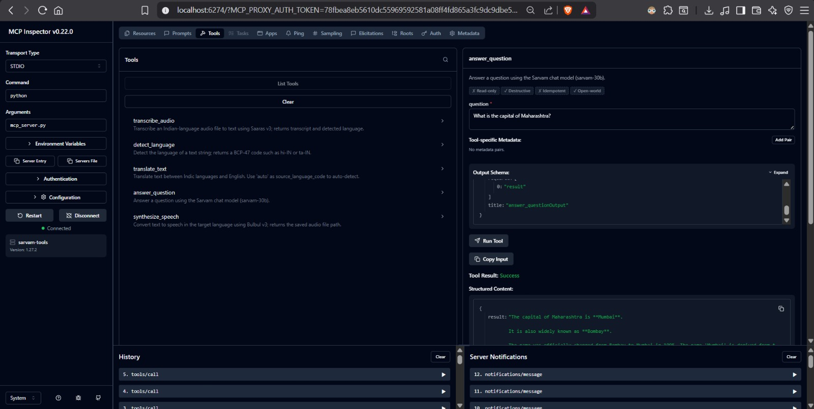
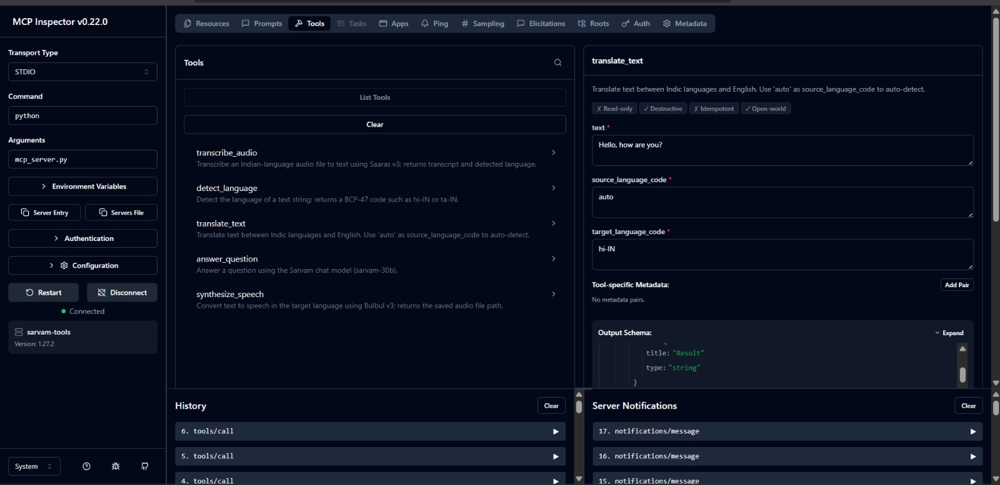
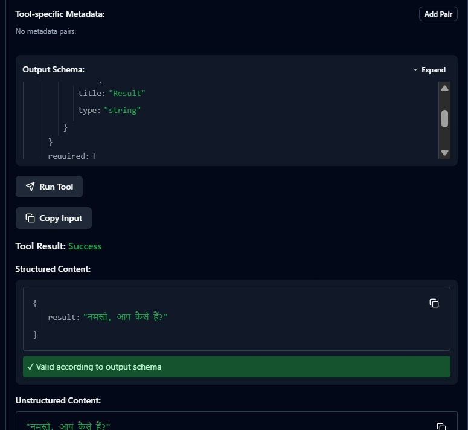
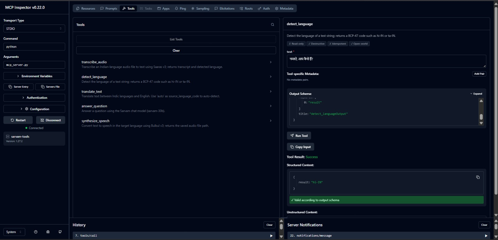
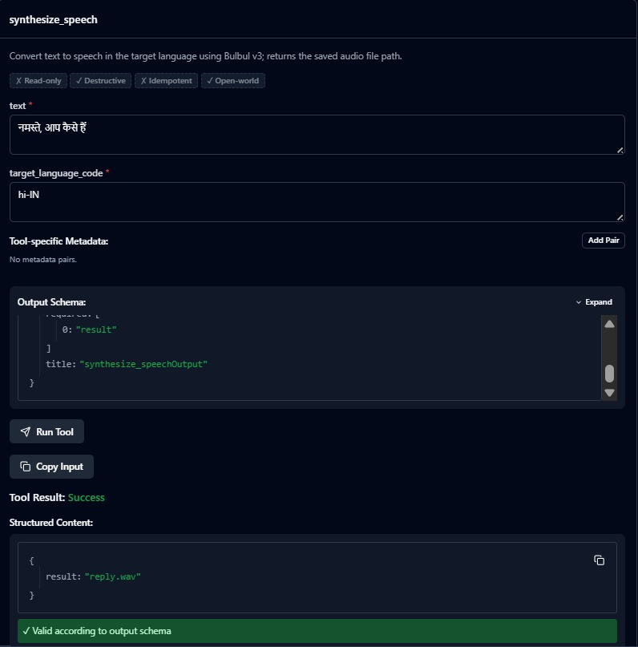
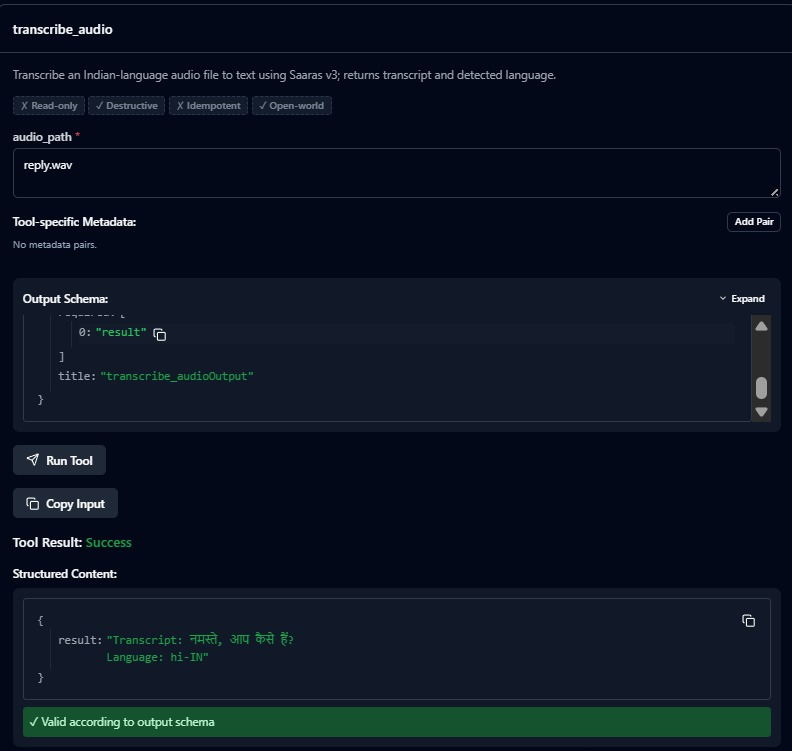

# Setu — Multilingual Voice Agent on Sarvam AI

> *Setu* (सेतु) means **bridge**. Speak a question in any major Indian language; an AI agent reasons over Sarvam's speech, translation, and chat tools and speaks the answer back in your language.

<br>

## What this project demonstrates

| Capability | How |
|---|---|
| Hands-on use of Sarvam models | Saaras v3 (STT), Bulbul v3 (TTS), Sarvam-Translate, sarvam-30b (chat) |
| Building an MCP server from scratch | FastMCP server wrapping all Sarvam tools — testable in isolation |
| Authoring an agent without a framework | `scratch_agent.py` — a hand-written JSON tool-call loop, no LangChain/LangGraph |
| Authoring the same agent with a framework | `graph_agent.py` — LangGraph ReAct consuming the same MCP server |

<br>

## Architecture

```
  User speaks  (Hindi / Marathi / Tamil / ...)
        │  audio in
        ▼
  ┌──────────────────────────┐
  │  app.py  (CLI)           │  record mic → run agent → play reply
  └──────────────────────────┘
        │  audio path / text query
        ▼
  ┌──────────────────────────┐      tool calls over MCP / JSON protocol
  │  Agent orchestrator      │ ─────────────────────────────────────────┐
  │                          │                                          │
  │  scratch_agent.py        │                                          │
  │  (no framework)    OR    │ ◄────────────────────────────────────────┘
  │  graph_agent.py          │      tool results
  │  (LangGraph)             │
  └──────────────────────────┘
                                              │
                                              ▼
                               ┌──────────────────────────────┐
                               │  mcp_server.py               │
                               │  "sarvam-tools"  (FastMCP)   │
                               │                              │
                               │  transcribe_audio  ────────► Saaras v3
                               │  detect_language   ────────► sarvam-30b
                               │  translate_text    ────────► Sarvam-Translate
                               │  answer_question   ────────► sarvam-30b
                               │  synthesize_speech ────────► Bulbul v3
                               └──────────────────────────────┘
                                              │
                                              ▼
                               ┌──────────────────────────────┐
                               │  sarvam_client.py            │
                               │  single source of truth      │
                               │  for every Sarvam API call   │
                               └──────────────────────────────┘
```

The agent **decides** which tools to call and in what order — it is not a hard-coded pipeline. A typical turn looks like:

1. `transcribe_audio` — WAV → text + detected language (e.g. `hi-IN`)
2. `translate_text` — translate question to English for better reasoning accuracy
3. `answer_question` — get the answer from `sarvam-30b`
4. `translate_text` — translate answer back to the user's language
5. `synthesize_speech` — text → WAV via Bulbul v3

The agent may skip steps (e.g. answer directly in Hindi without translation hops when the model handles it natively). That decision is the agent's, which is what makes this a real agent rather than a scripted pipeline.

<br>

## Tech stack

| Layer | Library / Model |
|---|---|
| Speech-to-text | Sarvam **Saaras v3** |
| Translation | Sarvam **Sarvam-Translate / Mayura** |
| Chat / reasoning | Sarvam **sarvam-30b** (64 K context, native tool calling) |
| Text-to-speech | Sarvam **Bulbul v3** |
| MCP server | **FastMCP** (`mcp` Python SDK) |
| Framework agent | **LangGraph** + `langchain-mcp-adapters` + `langchain-openai` |
| Audio I/O | `sounddevice` + `scipy` |
| Config | `python-dotenv` |

<br>

## Project structure

```
setu-agent/
├── sarvam_client.py      # Thin wrapper — only file that calls Sarvam APIs
├── mcp_server.py         # FastMCP server exposing 5 Sarvam tools
├── scratch_agent.py      # Agent loop with NO framework (the differentiator)
├── graph_agent.py        # Same agent built with LangGraph
├── app.py                # CLI voice entrypoint: mic → agent → speaker
├── requirements.txt
├── .env.example          # Copy to .env and add your key
└── assets/               # Screenshots used in this README
```

<br>

## Quickstart

### 1. Get a free Sarvam API key

Sign up at [dashboard.sarvam.ai](https://dashboard.sarvam.ai) — it's free.

### 2. Clone and set up

```bash
git clone https://github.com/Apurv428/setu-agent.git
cd setu-agent

python -m venv .venv
# Windows:
.venv\Scripts\activate
# macOS / Linux:
source .venv/bin/activate

pip install -r requirements.txt

cp .env.example .env
# Open .env and set: SARVAM_API_KEY=your_key_here
```

### 3. Verify the Sarvam client (recommended)

```bash
python sarvam_client.py
```

Expected: four `PASS` lines — translate, chat, synthesize, transcribe.

### 4. Inspect the MCP server

```bash
mcp dev mcp_server.py
```

Opens the MCP Inspector in your browser. Set **Command** → `python`, **Arguments** → `mcp_server.py`, add your `SARVAM_API_KEY` under Environment Variables, then click **Connect**. Call each tool by hand to confirm it works before running any agent.

### 5. Run an agent

```bash
# Framework-free scratch agent
python scratch_agent.py "What is the capital of India? Answer in Hindi."

# LangGraph agent (same MCP server)
python graph_agent.py "What is the capital of India? Answer in Hindi."
```

### 6. Full voice loop

```bash
# Text input (no mic required)
python app.py --text "भारत की राजधानी क्या है?"

# Mic input — records 5 seconds
python app.py

# Mic input — records longer
python app.py --seconds 8

# Use the LangGraph agent instead
python app.py --agent graph --text "महाराष्ट्र की राजधानी कौन सी है?"
```

<br>

## MCP Tools — verified results

All five tools were verified live in the MCP Inspector (v0.22.0) against the Sarvam API.

---

### `answer_question`

Answers a question using the Sarvam chat model (`sarvam-30b`).

**Input:** `"What is the capital of Maharashtra?"`



> Result: *"The capital of Maharashtra is **Mumbai**. It is also widely known as **Bombay**. The name was officially changed from Bombay to Mumbai in 1995..."*

---

### `translate_text`

Translates text between Indic languages and English. Supports `"auto"` as the source language for automatic detection.

**Input:** `"Hello, how are you?"` · source: `auto` · target: `hi-IN`



**Output:** `"नमस्ते, आप कैसे हैं?"`



---

### `detect_language`

Detects the language of a text string and returns a BCP-47 code.

**Input:** `"नमस्ते, आप कैसे हैं?"`



> Result: `hi-IN` ✓

---

### `synthesize_speech`

Converts text to speech using Bulbul v3 and returns the path to the saved WAV file.

**Input:** `"नमस्ते, आप कैसे हैं"` · target: `hi-IN`



> Result: `reply.wav` ✓

---

### `transcribe_audio`

Transcribes an Indian-language audio file using Saaras v3 and returns the transcript with the detected language code.

**Input:** `reply.wav` (the file written by `synthesize_speech` above — a full round-trip test)



> Result: `Transcript: नमस्ते, आप कैसे हैं? · Language: hi-IN` ✓

<br>

## The two agents — what's different

### `scratch_agent.py` — framework-free

The entire mechanism is visible. The model replies with JSON; we parse it, dispatch to a tool, append the observation, and repeat. This is the loop that LangGraph runs for you — building it once by hand is how you understand what a framework actually does.

```
{"tool": "answer_question", "args": {"question": "..."}}   ← call a tool
{"final": "नई दिल्ली भारत की राजधानी है।", "audio_path": "reply.wav"}  ← done
```

Handles: malformed JSON (re-prompts with the contract), unknown tools (reports available tools), and a configurable `max_steps` cap.

### `graph_agent.py` — LangGraph

The same behaviour, but LangGraph manages the state machine, the tool-call loop, and retries. The LLM is `sarvam-30b` via its OpenAI-compatible endpoint, which supports native tool calling — so there's no hand-written JSON protocol.

Both agents connect to the **same `mcp_server.py`** over stdio. That shared server boundary is the design: new agents, new clients, new tools — none of them need to know anything about the Sarvam SDK.

<br>

## Design decisions

**Why MCP instead of calling the functions directly?**
The MCP server is a clean, reusable boundary. The same server backs the scratch loop, the LangGraph agent, and anything else — tested in isolation with the inspector before any agent touches it.

**Why two agents?**
To make the contrast explicit. The scratch loop shows you the mechanism; LangGraph shows you what the framework automates. Building it once by hand earns the right to say you can author agents without a framework.

**Why a single `sarvam_client.py`?**
All Sarvam-specific request shapes, model IDs, and response formats live in one file. If Sarvam changes a field name, exactly one file changes.

<br>

## Failure modes handled

| Failure | Handling |
|---|---|
| Malformed JSON from the model | Re-prompt with the JSON contract; retry up to `max_steps` |
| Unknown tool name in model output | Return available tool names as the error observation |
| STT misrecognition on code-mixed speech | Saaras v3 `transcribe` mode; surface low-confidence results |
| Wrong language detection | STT-detected language is preferred; `translate(auto)` as fallback |
| API errors | Surfaced as tool-call errors; step cap prevents runaway loops |

<br>

## Limitations and next steps

- **Streaming** — Saaras and Bulbul both support WebSocket streaming for lower latency; this version uses the batch REST API.
- **RAG** — adding a `search_knowledge` tool backed by a small vector index would give the agent a real reason to choose between tools.
- **Eval** — a scored set of question/expected-answer pairs would make quality measurable and map directly to "eval pipelines and quality metrics."
- **Memory** — the agent currently has no memory across turns.
- **Observability** — tool-call tracing and guardrails before TTS output are natural next steps for a production deployment.

<br>

## Language codes supported

`hi-IN` Hindi · `mr-IN` Marathi · `ta-IN` Tamil · `te-IN` Telugu · `bn-IN` Bengali · `gu-IN` Gujarati · `kn-IN` Kannada · `ml-IN` Malayalam · `pa-IN` Punjabi · `od-IN` Odia · `en-IN` English

<br>

---

Built with [Sarvam AI](https://sarvam.ai) APIs · [dashboard.sarvam.ai](https://dashboard.sarvam.ai) for your free key
